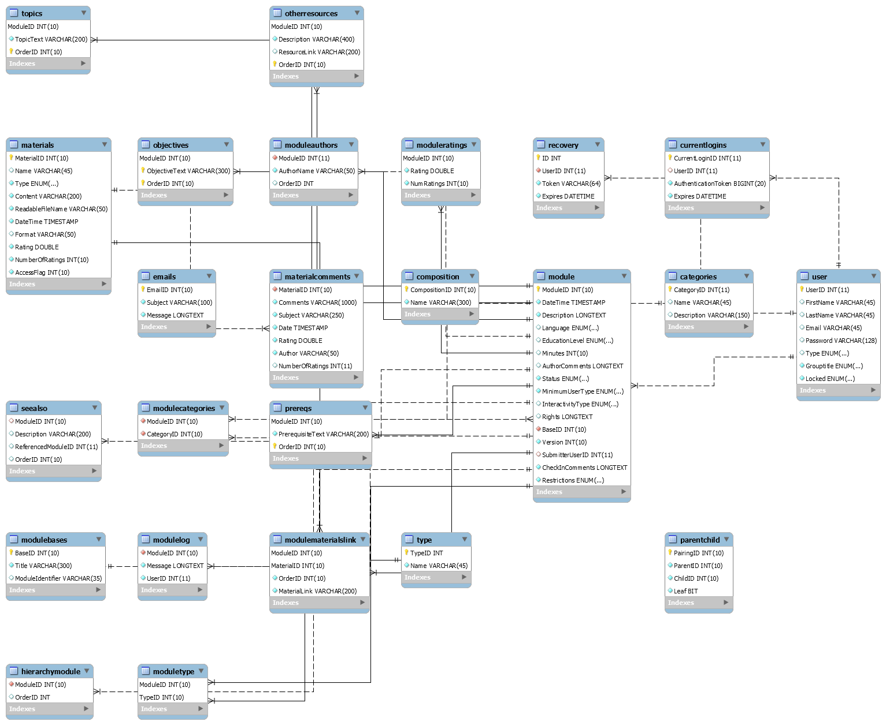

# EdCyan
An education material repository. This repo contains a prototype implementation of the system. 

Live Demo Available at:
https://afeldscher.github.io/SE410_Project/html/

## SE-410
SE-410 Team Cyan Implementation

### Team Members
|     Name        |  ID   |
|-----------------|-------|
| Adam Feldscher  | aff39 |
| Christopher Van | cv367 |
| Richard Yoon    | rsy32 |
| Kevin Wen       | kw633 |
| Rahul Godaba    | rpg46 |
| Aaron Zehm      | amz52 |

## Source Systems

This system is reverse engineered from the following source systems:

EdRepo: http://edrepo.sourceforge.net/

SWENET: http://swenet.org/

## Implementation 
We implemented 2 targets, the database and the user interface. 

### Target 1: Database
Our database is implemented as a MySQL database. 

We placed our target system schema in this repository in [mysql.sql](mysql.sql). This script can successfully be used to create the database.  

The following diagram reflects the schema described in the file:

### Target 2: User Interface
Our user interface is implemented as a series of html and css pages. These files are located in the [html directory](https://github.com/afeldscher/SE410_Project/tree/master/html) in this repository.  

This interface is only partially functional, since there is no backend to connect it to the datastore. 

#### Frameworks
To build out our interface we used the following frameworks:
* Bootstrap v4.4.1
* jQuery-3.2.1
